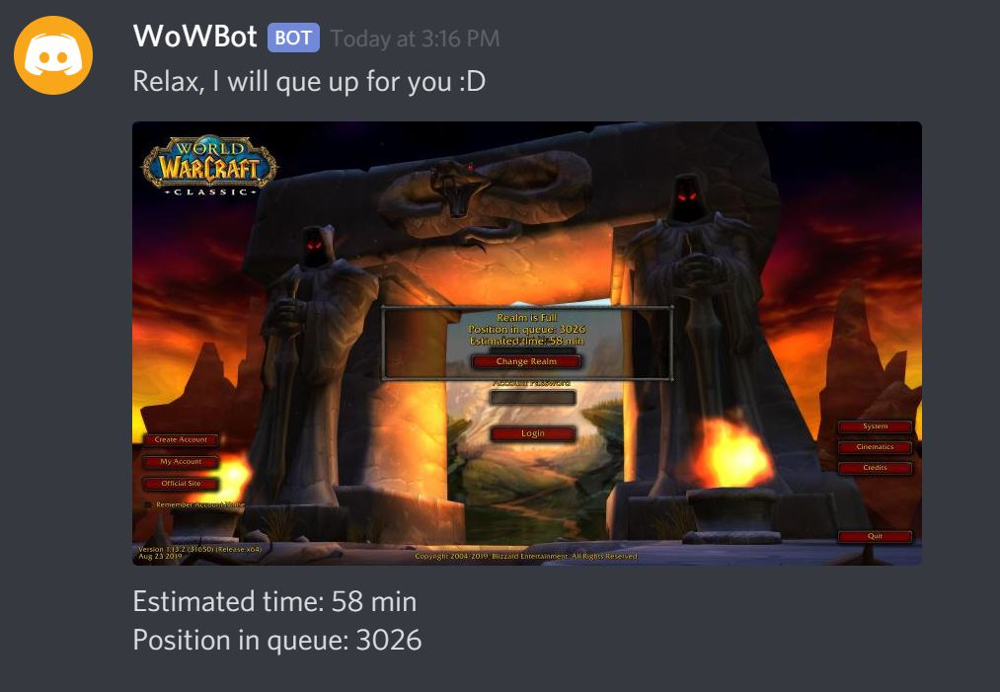

# Discord-Que-Bot

## Getting Started
Make sure you have python and pip installed

Create a discord application [from here ](discordapp.com/developers/applications/)
name your application what ever you want and then click on the settingstab "Bot".
1. Click add bot 
2. Then Click to reveal Token. Save this token.
3. Go To OAuth2 tab and select bot as scope
4. Add Send Messages and Attach Files as Bot permissions.
5. Copy the link and paste it in a new tab.
6. Select a server to add the bot to if you dont have one, create one and refresh the page.
 


After you have created the bot. Go ahead and create a new file name .env in this directory. Add the following to it.

```
TOKEN=YOUR DISCORD TOKEN
ACCOUNT=YOUR WOW ACCOUNT NAME
PASSWORD=YOUR WOW PASSWORD
```

### Azure Cognitive Services [optional]
if you want Azure Cognitive Services you need to create an instance of it on Azure and add
```
ENDPOINT=[endpoint]cognitiveservices.azure.com
AZURE_COGNITIVE_SERVICE_KEY=YOUR_SECRET_KEY
```
When that is done update azure variable in DiscordBot.py to True

This will enable you to get the position and estimated time of the que. The application will work without ACS

### Installation

Open powershell in working directory and run the following command
```
pip install -r .\requirements.txt
```
This might take a minute

### get x and y position of mouse
This is an important step because you will the bot need P(x,y) of realm server. Just hoover over your server and run the following command in powershell
```
Add-Type -AssemblyName System.Windows.Forms
[System.Windows.Forms.Cursor]::Position
```
Add the result to X_CLICK and Y_CLICK in init.ps1

Then run the configuration is done and you can start the bot with this command.
```
 python .\DiscordBot.py
```

Go to your channel in discord and type "que or position"


### Create a shortcut
Right click on the StartBot shortcut, click properties and change the location in "start in:" to where this repository is.
If that doesnt work try this manual approach. 


 1. Right click anywhere on the Desktop (or in a folder) and select New Shortcut.
 2. Navigate to C:\Windows\System32\WindowsPowerShell\v1.0. and select powershell.exe
 3. Finish
 4. Right click on shortcut and select Properties to open the new window
 5. In textbox called target write C:\Windows\System32\WindowsPowerShell\v1.0\powershell.exe python .\DiscordBot.py
 6. In Start in box write: C:\yourpath
 7. Press okay


### Fix image scaling in python
if the image receive in discord in not in full screen, then this should work.
 1. Go to where you have installed pythen and rightclick on python.exe and click properties
 2. Click on the compatibility tab click change high DPI settings 
 3. check Override high DPI scaling behavior 

 
